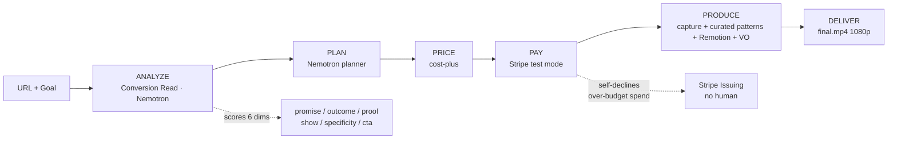
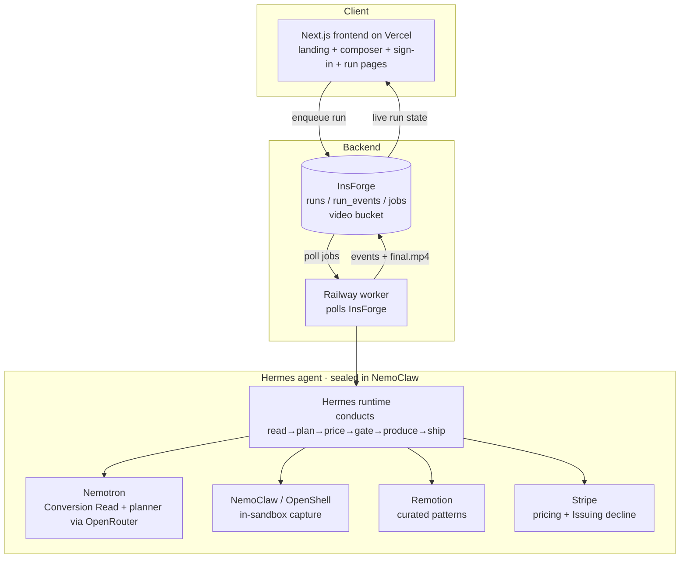

# Filmo

**Your product launch, produced by an autonomous agent.**

Give Filmo a product **URL + a goal**. It reads your real product, diagnoses why the page fails to convert, then plans, prices, pays for, and produces a finished **1080p launch video** — end to end, no human in the loop.

> Entry for the **Hermes Hackathon — Nous Research × NVIDIA × Stripe** (due 2026-06-30).
> **Live:** https://filmostudio.vercel.app

---

## What is Filmo

Filmo is an autonomous **agent** that produces product-launch videos. You hand it a live URL and a goal — *"more signups," "explain the product," "drive demo bookings"* — and it does the rest: reads the actual page, finds the conversion gap, plans the cut, prices the job, takes payment on Stripe, produces the video, and ships a real **1080p / AAC MP4**. No timeline editor, no prompt-wrangling, no human in the loop.

The whole pipeline is **conducted by a Hermes agent, sealed inside NVIDIA's NemoClaw sandbox** — the autonomous worker can only pull the tools we sanctioned, and it reasons on NVIDIA Nemotron between every step.

---

## The wedge

Most "AI video" tools hallucinate footage — generic b-roll, fake UI, a tagline you never wrote. It looks glossy and converts nobody, because it is not *your* product.

**Filmo is grounded and diagnostic.** It opens your page, captures your real UI and logo, and — before it animates a single frame — runs the **Conversion Read**: a diagnosis of *why the page fails to convert*. The video is built to fix that specific gap. And every shot is assembled from a **curated library of designer-quality scene patterns** harvested from real launch films — designed motion, not slop.

The wedge, in one line: **grounded + diagnostic + curated, vs. generic + hallucinated + sloppy.**

---

## How it works

You give Filmo a URL and a goal. The Hermes agent then conducts a seven-stage pipeline — each stage an explicit, inspectable step.

- **ANALYZE — the Conversion Read.** Filmo reads the page copy and asks **NVIDIA Nemotron** to score it across **six dimensions**: promise, outcome, proof, show, specificity, and CTA. The result (`conversion_read.json`) is the diagnosis — and it directly **seeds the plan**: the headline fix becomes the opening title, each weak dimension becomes a scene.
- **PLAN.** The **Nemotron** planner turns the goal plus the diagnosis into a **strict scene-plan JSON**. One planner owns the whole storyboard, so the cut is coherent rather than stitched from disconnected sub-agents — and each scene is typed to a **curated pattern** (split-stat, logo mosaic, device screenshot, pull-quote, kinetic statement…).
- **PRICE.** Cost-plus pricing from the plan's projected cost.
- **PAY.** Stripe (test mode). When a run would exceed budget, **the agent declines its own spend** via Stripe Issuing — no human approves or blocks it.
- **PRODUCE.** The agent captures the real page screenshot and logo **inside the NemoClaw sandbox**, renders the curated patterns in **Remotion**, narrates with **ElevenLabs** (with an automatic free-voice fallback so a render never fails), times words with whisper, and stitches with ffmpeg.
- **DELIVER.** A finished `final.mp4` — proven on real sites (a stripe.com run delivers H.264 1920×1080, ~32s, with the real Stripe screenshot, real wordmark, and the customer-logo mosaic).

---

## The agent + the three sponsors

Filmo is built squarely on the hackathon's three sponsors — one for the agent runtime, one for the brain and the sandbox, one for the money.

### Nous / Hermes — the agent runtime
**Hermes is the harness** — the agent runtime that *orchestrates the whole pipeline*. It conducts the stages (read → plan → price → gate → produce → ship), reasoning between them and narrating each step. Hermes is **not** a model that does one step; it is the autonomous agent that perceives (reads the product), decides (diagnoses, plans, prices, and gates its own spend), acts (pays and produces), and delivers — the Hermes agent thesis applied to a job people actually pay for.

### NVIDIA — the brain and the sandbox
**Nemotron is the brain** behind *every* reasoning call — the Conversion Read **and** the storyboard planner — served via OpenRouter across tiers (`super-free` 120B default, `ultra-paid` 550B flagship). **NemoClaw / OpenShell is the secure sandbox**: the agent is contained inside it and screenshots **any URL** safely, with a per-job egress allowlist (proven on nvidia.com, python.org, notion.com). The pitch: *the agent that could go rogue is sealed in NVIDIA's sandbox and can only pull the levers we sanctioned.*

### Stripe — autonomous money
Stripe handles autonomous pricing and payment in test mode. The signature moment: when a planned run goes over budget, the agent's card **declines its own purchase** through **Stripe Issuing** — a real authorization decline, decided and enforced without a human in the loop. Spend governance is part of the agent, not a manual gate.

---

## The curated pattern library — the anti-slop moat

The reason Filmo's output looks designed, not generated: every scene is drawn from a **curated library of designer-quality scene patterns**, harvested from real launch films (the Luceo Studio library) and recorded as a single source of truth with a **visible Lookbook on the site**. The planner picks each scene's pattern by content fit (stats → split-stat, customers → logo mosaic, a homepage → device screenshot, a quote → pull-quote) and brand vibe, then **real brand extraction** drops in the actual logo, palette, and screenshot. The look DNA is consistent: text-left / glass-UI-right / brand-accent headline / device-as-hero. An honesty guard never fabricates a stat or a customer — data-poor brands degrade gracefully instead of inventing.

---

## Architecture

Filmo splits into a **frontend** (Next.js on Vercel), an **async worker** (Railway), the **Hermes agent** (Nemotron brain + NemoClaw sandbox + Remotion renderer + Stripe), and an **InsForge** backend (Postgres `runs` / `run_events` / `jobs` tables + the video storage bucket). The frontend enqueues a run; the worker drives the agent; events and the final video stream back live.

---

## Tech stack

| Layer | Technology |
| --- | --- |
| Agent runtime | **Nous Hermes** — the harness that orchestrates the pipeline |
| Brain (all reasoning) | **NVIDIA Nemotron** via OpenRouter — Conversion Read **and** storyboard planner (`super-free` 120B default, `ultra-paid` 550B) |
| Secure capture sandbox | **NVIDIA NemoClaw / OpenShell** — in-sandbox screenshot with per-job egress allowlist |
| Payments | **Stripe** (test mode) + Stripe Issuing (autonomous over-budget decline) |
| Scene system | Curated pattern library (designer-quality patterns) + real brand extraction (logo / palette / screenshot) |
| Frontend | Next.js (Vercel), sign-in via InsForge OAuth |
| Async worker | Railway (Docker) polling InsForge |
| Backend / data | InsForge (Postgres + video storage bucket) |
| Video render | Remotion |
| Voiceover / timing | ElevenLabs (with automatic free-voice fallback) + whisper word timing |
| Stitch / encode | ffmpeg (H.264 / AAC, 1080p) |

---

## Status

**Hackathon entry.** The full pipeline delivers real 1080p video — grounded in the live page, with the real logo, real screenshot, and the curated patterns. All three sponsor axes are wired: Hermes conducts the run, Nemotron is the brain, NemoClaw sandboxes the capture, and Stripe runs the autonomous money (including the over-budget self-decline). Hosted for anyone at **https://filmostudio.vercel.app**.

---

## Credits

Built for the **Hermes Hackathon — Nous Research × NVIDIA × Stripe**. The aesthetic is grounded in a curated launch-film pattern library. Private during development.
