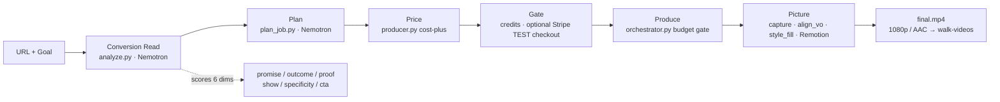
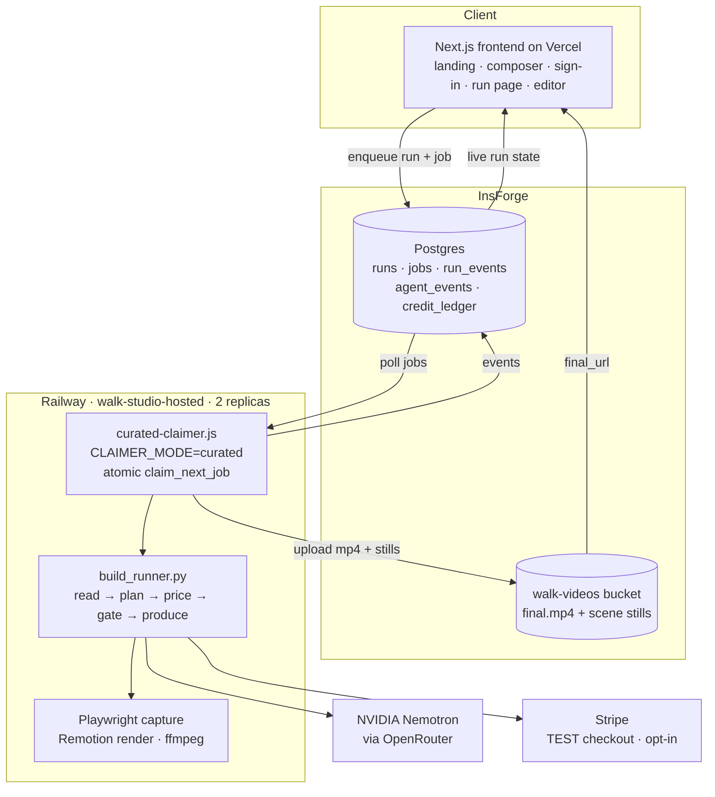

# Filmo

**Your product launch, produced by an AI agent.**

Give Filmo a product **URL + a goal**. It reads your real page, diagnoses why that page fails to
convert, plans a storyboard against the diagnosis, and produces a finished **1080p launch video** —
your real screenshot, your real logo, your palette. A deterministic pipeline runs the whole job end
to end and streams every step to a live feed.

> **Live:** https://filmo.dev

---

## What is Filmo

Filmo is an agentic **producer** of product-launch videos. You hand it a live URL and a goal —
*"more signups," "explain the product," "drive demo bookings"* — and it does the rest: reads the
actual page, reads the conversion gap, plans the cut, prices the job, produces the video, and ships
a real **1080p / AAC MP4**. No prompt-wrangling. You never *have* to touch a timeline — though an
in-browser editor is there if you want to tweak, and a chat director can apply edits for you before
you download.

---

## The wedge

Most "AI video" tools hallucinate footage — generic b-roll, fake UI, a tagline you never wrote. It
looks glossy and converts nobody, because it is not *your* product.

**Filmo is grounded and diagnostic.** It opens your page in a headless browser, captures your real
hero UI and logo, and — before it animates a single frame — runs the **Conversion Read**: Nemotron
scores your page copy across six conversion dimensions and names the weakest one. The video is built
to fix that specific gap. And every shot is assembled from a **curated library of designer-quality
scene patterns** — designed motion, not slop.

The wedge, in one line: **grounded + diagnostic + curated, vs. generic + hallucinated + sloppy.**

---

## How it works

The web app enqueues a run into InsForge. The Railway worker claims it atomically and runs the
deterministic `build_runner.py` pipeline, which streams its ledger into `run_events` so the run page
narrates each step live.

1. **Conversion Read** (`read_pass.py` → `analyze.py`). A cheap hero-only capture pulls the page's
   visible copy, then Nemotron scores it across **six dimensions** — promise, outcome, proof, show,
   specificity, CTA — and names the weakest. The Read **seeds the plan**: the headline fix becomes
   the opening title, each weak dimension becomes a scene. It degrades honestly: the brain chain
   falls `ultra-paid` → `super-paid` → a local `minimal_read` floor, so a build never blocks on the
   model.
2. **Plan** (`plan_job.py`). One planner turns the goal plus the Read into a **strict scene-plan
   JSON** (`plan_schema.py` validates it), so the cut is coherent rather than stitched from
   disconnected sub-agents. Each scene is typed to a **curated pattern**.
3. **Price** (`producer.py`). Cost-plus pricing from the plan's projected COGS, capped, written into
   the run ledger before anything is spent.
4. **Gate**. The live gate is **credits** (see below). A real Stripe **TEST** checkout is opt-in
   (`payMode: 'human'`) and is forced for `mode: 'real'` builds, which spend real third-party COGS.
5. **Produce** (`orchestrator.py`). Scenes are produced in order under a locked budget gate that can
   approve, downgrade, or decline each paid scene; the ledger records every verdict and the P&L.
6. **Picture** (`build_runner._run_vo_engine`). Playwright captures the real page, `align_vo`
   narrates and word-times it, `build_timeline` + `style_fill` fill the curated patterns with the
   real brand, and Remotion renders the Timeline. An ExplainerCard floor means a beat with no real
   footage still renders as designed motion — never a blank.
7. **Ship**. The worker uploads `final.mp4` plus per-scene stills to the `walk-videos` bucket and
   stamps `runs.final_url`; the run page and the editor pick it up live.

**Voiceover** is ElevenLabs by default, with an automatic free `edge-tts` + local `whisper.cpp`
fallback baked into the worker image — so a render never fails on VO.

**Looks:** `classic` (light Timeline), `engineered-night` (dark one-world), and `walkrec` (beta).

---

## Credits

Filmo's beta gate is a **credit ledger**, not a per-video checkout. Credits are tokens: 1 credit =
35 tokens of model work, so a thing costs what it actually costs to think about.

| | Cost |
|---|---|
| A film | **640 credits** (~22.4k tokens: plan + a critic that sees 6 stills) |
| An edit | **70 credits** (~2.5k tokens: beats + events tail + the reply) |
| Daily allowance | 3,000 credits |
| Beta lifetime allowance | 15,000 credits |

The ledger (`credit_ledger`) is append-only — spends negative, refunds positive, `run_id` links a
spend to its build — and balances are **derived, never stored**. A film is charged at creation and
**refunded automatically if the build fails**, so a failed attempt never consumes your allowance.
Conversation and gate-declined edits are free.

---

## The curated pattern library — the anti-slop moat

The reason Filmo's output looks designed, not generated: every scene is drawn from a **curated
library of 14 designer-quality scene patterns**, recorded in a single source of truth
(`studio/src/timeline/patterns.catalog.json`, loaded by `patterns_catalog.py`) with a **visible
Lookbook on the site**. Most are hand-designed; three (`kinetic-statement`, `process-pipeline`,
`scan-grid`) carry a literal `harvestedFrom` tag to a named Luceo Studio launch film.

The planner picks each scene's pattern by content fit (stats → split-stat, customers → logo mosaic,
a homepage → device screenshot, a quote → pull-quote) and brand vibe; `style_fill` records a legible
`data.patternReason` for every choice. Then **real brand extraction** drops in the actual logo,
palette, and screenshot. The look DNA is consistent: text-left / glass-UI-right / brand-accent
headline / device-as-hero. An **honesty guard** never fabricates a stat or a customer — data-poor
brands degrade gracefully to a centered card instead of inventing.

---

## Architecture

Filmo splits into a **frontend** (Next.js on Vercel), an **InsForge** backend (Postgres +
`walk-videos` storage bucket + auth), and an **async worker** on **Railway** (service
`walk-studio-hosted`, 2 replicas) that runs the deterministic Python pipeline. The frontend enqueues
a run; a worker replica claims it atomically; events and the final video stream back live.

The same worker also serves two other job types: `rerender` (an editor save) and `director` (a chat
edit turn, `director_job.py`), so edits re-render on the same image that produced the film.

Deploy paths, envs, and the runbook are in **[`DEPLOY.md`](DEPLOY.md)** and
**[`RAILWAY-CUTOVER.md`](RAILWAY-CUTOVER.md)**.

---

## Tech stack

| Layer | Technology |
| --- | --- |
| Frontend | **Next.js 15 / React 19 on Vercel** — landing, composer, live run feed, in-browser Remotion editor; canonical origin `filmo.dev` |
| Backend / data / auth | **InsForge** — Postgres (`runs`, `jobs`, `run_events`, `agent_events`, `credit_ledger`, `developers`) + the public `walk-videos` storage bucket + OAuth/password auth |
| Job queue | InsForge `jobs` + the atomic `claim_next_job` RPC |
| Async worker | **Railway** service `walk-studio-hosted` (2 replicas) — Docker image boots `agent-host/vm/curated-claimer.js` at `CLAIMER_MODE=curated`, which runs the deterministic `build_runner.py` pipeline |
| Brain (all reasoning) | **NVIDIA Nemotron via OpenRouter** — Conversion Read on `nvidia/nemotron-3-ultra-550b-a55b` (`ultra-paid`), falling back to `nvidia/nemotron-3-super-120b-a12b` (`super-paid`); the storyboard planner defaults to `nvidia/nemotron-3-super-120b-a12b:free` (`super-free`) |
| Payments | **Stripe** (test mode) — credit ledger is the live gate; an opt-in TEST checkout gate and a Stripe Issuing self-decline path are also implemented |
| Scene system | Curated 14-pattern library + real brand extraction (logo / palette / screenshot) |
| Video render | **Remotion** (`studio/`) — the VO-driven `Timeline` composition |
| Capture | Playwright (Chromium) on the worker, behind an SSRF guard (`url_guard.py`) |
| Voiceover / timing | **ElevenLabs**, with automatic `edge-tts` + `whisper.cpp` fallback |
| Stitch / encode | ffmpeg (H.264 / AAC, 1080p) |

---

## Status

**Live at [filmo.dev](https://filmo.dev).** The full pipeline delivers real 1080p video grounded in
the live page — real logo, real screenshot, curated patterns — from a URL and a goal, with credits
as the beta gate and automatic refunds on failure.

Verified: the Railway worker is the only production producer (the image pins
`CLAIMER_MODE=curated`); the Conversion Read and planner run on Nemotron through OpenRouter; the
credit ledger charges and refunds; ElevenLabs VO with a free fallback; Remotion render + upload to
the `walk-videos` bucket.

Not verified / known rough edges: paid credit top-ups are not wired (the beta allowance is the only
supply); `mode: 'real'` (paid Higgsfield cinematic scenes) is gated behind an opt-in Stripe TEST
checkout and is not the default path; the `walkrec` look is beta.

---

## History

Built for the **Hermes Hackathon** (Nous Research × NVIDIA × Stripe, June 2026); moved to the
curated Railway pipeline in July 2026. The hackathon-era harness and sandbox material is kept for
reference under [`deploy/retired/`](deploy/retired/) and is not used by the Railway image.

---

## License

MIT — see [`LICENSE`](LICENSE). Built by Dennis Wang / Luceo Studio. The aesthetic is grounded in a
curated launch-film pattern library.
