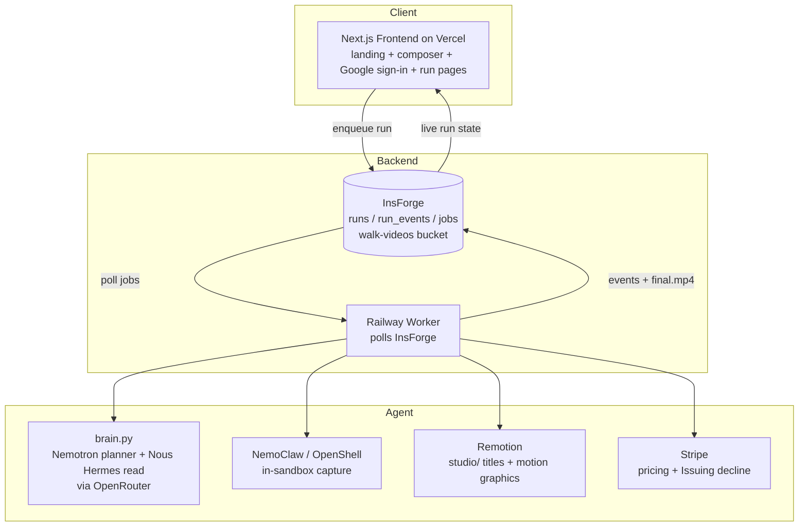

# Filmo

**Your Product Launch AI Agent.**

Give Filmo a product **URL + a goal**. It reads your real product, diagnoses how the page fails to convert, then plans, prices, pays, and produces a finished **1080p launch video** — autonomously, end to end.

[](https://build.nvidia.com)
[](https://nousresearch.com)
[](https://stripe.com)
[](https://nextjs.org)
[](https://remotion.dev)
[](https://insforge.dev)
[](https://railway.app)
-lightgrey)

> Entry for the **Hermes Hackathon — Nous Research × NVIDIA × Stripe** (due 2026-06-30).
> The GitHub repo is named `walk-studio`; the product is **Filmo**.

---

## What is Filmo

Filmo is an autonomous agent that produces product-launch videos. You hand it a live URL and a goal — *"more signups," "explain the product," "drive demo bookings"* — and it does the rest: reads the actual page, finds the conversion gap, writes a scene plan, prices the job, takes payment on Stripe, renders the video, and ships a real **1080p / AAC MP4**. No timeline editor, no prompt-wrangling, no human in the loop.

**Live demo:** https://walkstudioprojects.vercel.app

---

## The problem and the wedge

Most "AI video" tools hallucinate footage. They invent a glossy product that does not match what you actually shipped — generic b-roll, fake UI, a tagline you never wrote. It looks impressive and converts nobody, because it is not *your* product.

**Filmo is grounded in your real product.** It opens your page, captures your real UI, and — before it animates a single frame — runs the **Conversion Read**: a diagnosis of *why the page fails to convert*. The video is built to fix that specific gap, not to look pretty in the abstract.

The wedge, in one line: **grounded and diagnostic, vs. generic and hallucinated.**

---

## How it works

You give Filmo a URL and a goal. From there the agent runs a seven-stage pipeline. Every stage is an explicit, inspectable step — the agent reads the page, scores it, plans against the diagnosis, prices the work, clears its own payment, produces the cut, and delivers the file.


- **ANALYZE — the Conversion Read.** Filmo reads the page copy and asks **Nous Hermes 3 405B** (the primary) to score it across **six dimensions**: promise, outcome, proof, show, specificity, and CTA. The result (`conversion_read.json`) is the diagnosis — and it directly **seeds the plan**: the headline fix becomes the opening title, each weak dimension becomes a scene. The free Hermes tier is occasionally rate-limited, so the Read is made **reliable** with a tiered fallback: short 429 backoff+retry on Hermes, then **Nemotron Ultra as a reliability fallback**, then a deterministic minimal read as the floor. Each Read records which model produced it (`engine`: `nous-hermes-3-405b` / `nous-hermes-4-405b` / `nemotron-ultra-fallback` / `minimal`) so the dashboard never claims Hermes ran when the fallback did.
- **PLAN.** The Nemotron planner turns the goal plus the diagnosis into a **strict scene-plan JSON**. One planner owns the whole storyboard, so the cut is coherent rather than stitched from disconnected sub-agents.
- **PRICE.** Cost-plus pricing from the plan's projected cost.
- **PAY.** Stripe (test mode). When a run would exceed budget, **the agent declines its own spend** via Stripe Issuing — no human approves or blocks it (see below).
- **PRODUCE.** The orchestrator captures real screenshots, renders titles and motion graphics in Remotion, generates voiceover with edge-tts, gets word-level timing from whisper, and stitches everything with ffmpeg.
- **DELIVER.** A finished `final.mp4` — proven on real sites (e.g. a stripe.com run delivered H.264 1920×1080, 32s).

---

## Three sponsor axes

Filmo is built squarely on the hackathon's three sponsors.

### NVIDIA Nemotron
Nemotron is the **storyboard planner** — it writes the **scene plan** and drives the agent's build reasoning, served via OpenRouter across three tiers (`super-free` 120B as default, `ultra-paid` 550B, `super-paid`). Capture runs in the **NemoClaw / OpenShell sandbox**, letting the agent safely screenshot **any URL** (proven on nvidia.com, python.org, notion.com).

### Stripe
Stripe handles autonomous pricing and payment in test mode. The signature moment: when a planned run goes over budget, the agent's card **declines its own purchase** through **Stripe Issuing** — a real authorization decline, decided and enforced without a human in the loop. Spend governance is part of the agent, not a manual gate.

### Nous / Hermes
**Nous Hermes 3 405B runs the Conversion Read** — the page diagnosis that scores all six dimensions and produces `conversion_read.json`, served via OpenRouter (`hermes`, $0 free tier; `hermes-405b` Hermes 4 available as a paid upgrade). Hermes is the honest **primary**; because the free tier is intermittently rate-limited (HTTP 429), the Read backs off and retries Hermes, then falls back to **Nemotron Ultra** for reliability (tagged `nemotron-ultra-fallback` so we never misattribute it to Hermes), then to a deterministic minimal read as the floor. And the whole system is framed as a single autonomous agent: it perceives (reads the product), decides (diagnoses and plans), acts (pays and produces), and delivers — the Hermes agent thesis, applied to a job people actually pay for.

---

## Key features

- **Conversion Read.** A real diagnosis of *why your page fails to convert*, scored across six dimensions, before any animation — and it shapes the whole video.
- **Grounded in your real product.** Reads your live page and captures your actual UI. No hallucinated footage, no invented taglines.
- **Autonomous Stripe decline.** The agent enforces its own budget by declining over-budget spend through Stripe Issuing — no human approval.
- **Capture any URL, safely.** In-sandbox capture via NemoClaw / OpenShell handles arbitrary sites with per-job egress policy.
- **Structured, editable scenes.** The plan is strict JSON and the video is Remotion — every scene is inspectable and changeable, not a black-box render.
- **Hosted for anyone.** A stranger's URL becomes a 1080p video through the live Vercel + Railway deployment.
- **Curated aesthetic.** Output is grounded in the **Luceo Studio** launch-film library — designed motion graphics, not slop.

---

## Architecture

Filmo splits into a **frontend** (Next.js on Vercel), an **async worker** (Railway), a **brain** (Nemotron via OpenRouter), a **renderer** (Remotion), and a **capture sandbox** (NemoClaw). They coordinate through **InsForge** — a Postgres-backed backend holding `runs`, `run_events`, and `jobs` tables plus the `walk-videos` storage bucket. The frontend enqueues a run; the worker polls InsForge, drives the pipeline, and writes events and the final video back; the frontend reads run state live.



**Run topology**
- **Local demo** runs the full pipeline from the `main` branch via the dashboard (`dashboard/serve.py` → `localhost:3030`), including the Stripe Issuing setup.
- **Hosted** uses the Next.js frontend on Vercel and a Railway worker polling InsForge for cloud delivery to anyone.

---

## Tech stack

| Layer | Technology |
| --- | --- |
| Storyboard planner | NVIDIA Nemotron (via OpenRouter) — `super-free` 120B default, `ultra-paid` 550B |
| Conversion Read (page diagnosis) | Nous Hermes 3 405B primary (via OpenRouter, `hermes` free tier; `hermes-405b` Hermes 4 paid upgrade), with Nemotron Ultra as reliability fallback (`engine` field records which ran) |
| Frontend | Next.js (Vercel), Google sign-in via InsForge OAuth |
| Async worker | Railway (Docker) polling InsForge |
| Backend / data | InsForge (Postgres tables + `walk-videos` storage bucket) |
| Video render | Remotion (`studio/`) |
| Capture | NemoClaw / OpenShell sandbox |
| Voiceover / timing | edge-tts + whisper (word-level) |
| Stitch / encode | ffmpeg (H.264 / AAC, 1080p) |
| Payments | Stripe (test mode) + Stripe Issuing |
| Aesthetic source | Luceo Studio launch-film library |

---

## Getting started

### Prerequisites
- Python 3.11+, Node (for Remotion renders), ffmpeg
- Docker Desktop (only for NemoClaw in-sandbox capture)

### Environment keys
Secrets are **not** stored in the repo. They live in:
- `~/.hermes/.env` — `STRIPE_SECRET_KEY` (Stripe sandbox, Issuing enabled), `INSFORGE_URL`, `INSFORGE_API_KEY`
- `~/.zshrc` — `OPENROUTER_API_KEY` (routes both the Nemotron planner and the Nous Hermes Conversion Read); run `source ~/.zshrc` before any command that needs it

(Values are never printed here. Verify presence by length, not value.)

### Run the local dashboard
```sh
cd hermes-video-agent
python3 dashboard/serve.py
# open http://localhost:3030 in Safari
# the composer POSTs /api/build → runs the real pipeline
# use mode "mock" / "standard" for a $0 build
```

### Run the test suite (free, $0)
```sh
./run_all_tests.sh --no-eval
# 21+ unittest suites + the node panel test + stripe-earn
```

### Enqueue a cloud build (hosted path, $0)
```sh
cd walk-studio-hosted/worker
node --env-file=.env enqueue.js
# the Railway worker picks it up by polling InsForge
```

### Optional flags
- `PRODUCER_CONVERSION_READ=1` — turn on the Conversion Read stage (default off = byte-identical legacy path)
- `CAPTURE_BACKEND=nemoclaw` — capture inside the NemoClaw sandbox (needs Docker + the sandbox)

---

## Status and roadmap

**Status:** Hackathon entry. Engineering is essentially complete — all three sponsor axes are covered and the full pipeline delivers real 1080p video, locally and in the cloud.

**Done**
- End-to-end pipeline (URL → ANALYZE → PLAN → PRICE → PAY → PRODUCE → DELIVER), proven on real sites.
- Conversion Read — verified to genuinely work; demo-quality on linear.app and Stripe.
- NemoClaw in-sandbox capture for arbitrary URLs.
- Autonomous Stripe Issuing decline (local money-shot).
- Hosted cloud delivery (Vercel frontend + Railway worker + InsForge), with a Google sign-in gate.

**In progress / next**
- The 2–3 minute pitch and demo cut (highest-leverage remaining work).
- Surfacing the Conversion Read on the hosted dashboard (currently local-only).
- A sharper `webhook_declined` variant of the Stripe decline (the current artifact reason is `authorization_controls`).
- Deploying the `run.js` partial-success fix to the cloud worker (clean builds already deliver fine).

---

## Credits

Built for the **Hermes Hackathon — Nous Research × NVIDIA × Stripe**.

The aesthetic is grounded in **Luceo Studio**, a curated launch-film library.

Repo: `walk-studio` · Product: **Filmo** · Private during development.
