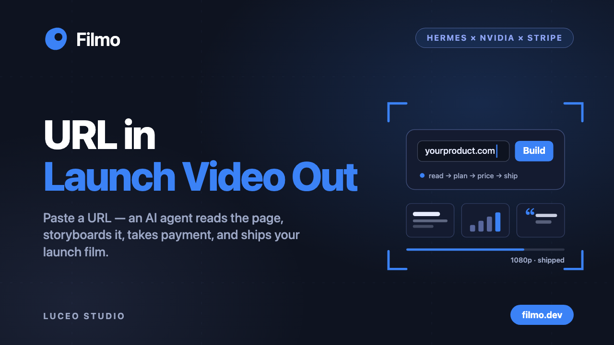
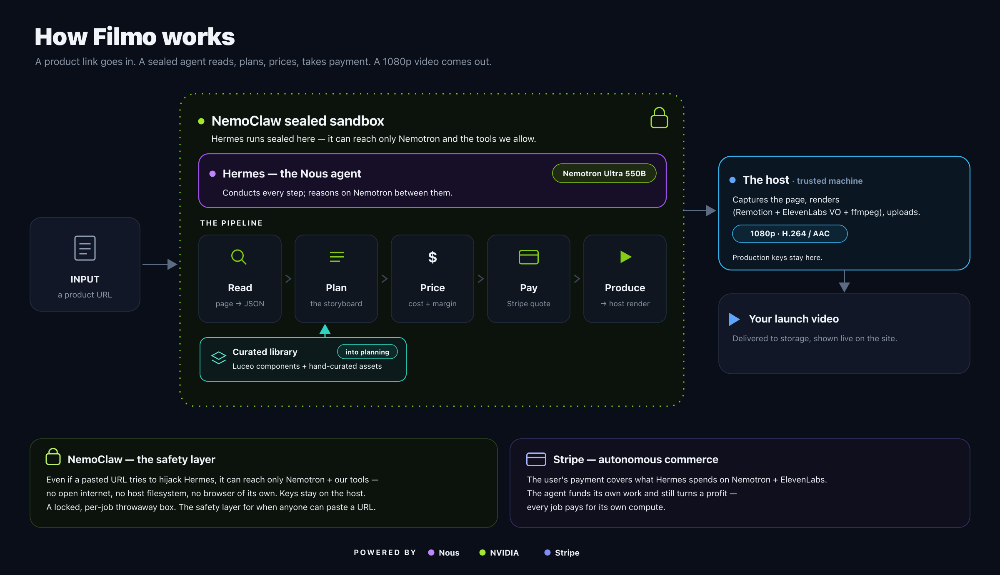
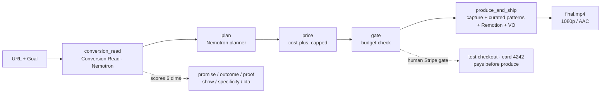
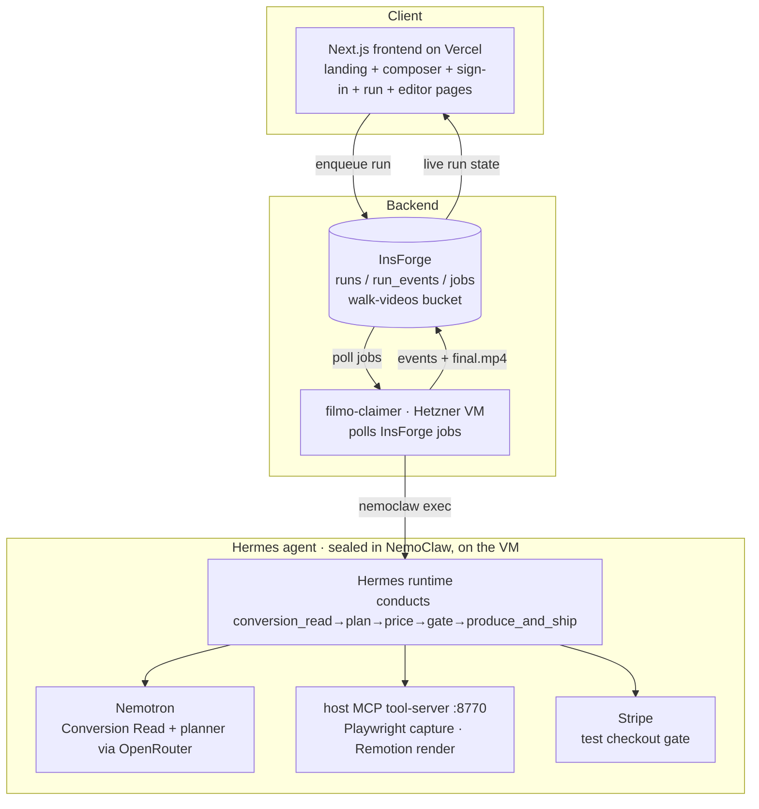

# Filmo

**Your product launch, produced by an AI agent.**

Give Filmo a product **URL + a goal**. It reads your real product, reads why the page fails to convert, then plans, prices, and presents a **Stripe checkout** — you pay (test card `4242`), and it produces a finished **1080p launch video**. One agent runs the whole pipeline end to end.

[-D50C2D?logo=hetzner&logoColor=white)](https://hetzner.com)

> Entry for the **Hermes Hackathon — Nous Research × NVIDIA × Stripe** (due 2026-06-30).
> **Live:** https://filmo.dev
> **Launch post:** https://x.com/dennis_wang19/status/2071945390048542803

---

## What is Filmo

Filmo is an agentic **producer** of product-launch videos. You hand it a live URL and a goal — *"more signups," "explain the product," "drive demo bookings"* — and it does the rest: reads the actual page, reads the conversion gap, plans the cut, prices the job, presents a Stripe checkout (you pay a test card), produces the video, and ships a real **1080p / AAC MP4**. No prompt-wrangling. You never *have* to touch a timeline — though an in-browser editor is there if you want to tweak before you download.

The whole pipeline is **conducted by a Hermes agent, sealed inside NVIDIA's NemoClaw sandbox** — the agent can only pull the host tools we sanctioned, and it reasons on NVIDIA Nemotron between every step.

---

## The wedge

Most "AI video" tools hallucinate footage — generic b-roll, fake UI, a tagline you never wrote. It looks glossy and converts nobody, because it is not *your* product.

**Filmo is grounded and diagnostic.** It opens your page in a headless browser, captures your real hero UI and logo, and — before it animates a single frame — runs the **Conversion Read**: NVIDIA Nemotron scores your page copy across six conversion dimensions and names the weakest one. The video is built to fix that specific gap. And every shot is assembled from a **curated library of designer-quality scene patterns** — designed motion, not slop.

The wedge, in one line: **grounded + diagnostic + curated, vs. generic + hallucinated + sloppy.**

---

## How it works

You give Filmo a URL and a goal. The Hermes agent then conducts **five host MCP tools** — once each, in strict order — each one an explicit, inspectable step that streams to the live feed.

- **conversion_read — the Conversion Read.** Filmo reads the page copy and asks **NVIDIA Nemotron** to score it across **six dimensions**: promise, outcome, proof, show, specificity, and CTA. The result (`conversion_read.json`) is the read — and it directly **seeds the plan**: the headline fix becomes the opening title, each weak dimension becomes a scene.
- **plan.** The **Nemotron** planner turns the goal plus the read into a **strict scene-plan JSON**. One planner owns the whole storyboard, so the cut is coherent rather than stitched from disconnected sub-agents — and each scene is typed to a **curated pattern** (split-stat, logo mosaic, device screenshot, pull-quote, kinetic statement…).
- **price.** Cost-plus pricing from the plan's projected cost, capped.
- **gate.** The agent reads, plans, and prices **first** — *then* presents a real Stripe **TEST** checkout for that actual price; the human pays (card `4242`), and only then does produce run. So you see the real plan and price before you pay. (The codebase also carries a fully-autonomous Stripe Issuing path — a card that declines its own over-budget `issuing_authorization.request` from the live budget — implemented but not the hosted default.)
- **produce_and_ship.** A host tool captures the real page screenshot and logo (headless Playwright **on the trusted host**, fetching only the one SSRF-vetted customer URL), renders the curated patterns in **Remotion**, narrates with **ElevenLabs** (with an automatic free-voice fallback so a render never fails), times words with whisper, stitches with ffmpeg, and uploads the MP4. The agent only conducts; the tools do the work.
- **Delivered.** A finished `final.mp4` — proven on real sites (a github.com run delivers H.264 1920×1080 / AAC, ~26s, Hermes-conducted, with the real screenshot, wordmark, and customer-logo mosaic).

---

## The agent + the three sponsors

Filmo is built squarely on the hackathon's three sponsors — one for the agent runtime, one for the brain and the sandbox, one for the money.

### Nous / Hermes — the agent runtime
**Hermes is the harness** — the agent runtime that *orchestrates the whole pipeline*. It conducts the five stages (conversion_read → plan → price → gate → produce_and_ship), reasoning between them and narrating each step. Hermes is **not** a model that does one step; it is the agent that perceives (reads the product), decides (reads the page, plans, prices, gates), acts (produces and ships), and delivers — the Hermes agent thesis applied to a job people actually pay for. It is a strict conductor: it calls each host tool exactly once and never does the production work itself.

### NVIDIA — the brain and the sandbox
**Nemotron is the brain** behind *every* reasoning call — the Conversion Read **and** the storyboard planner — served via OpenRouter. The hosted default is the **`ultra-paid` 550B flagship** (`nvidia/nemotron-3-ultra-550b-a55b`), with cheaper `super-paid` / `super-free` 120B tiers selectable and used as fallbacks. **NemoClaw / OpenShell is the secure sandbox**: the agent is contained inside it, and the host capture tool it triggers screenshots a **per-job-vetted URL** behind an egress allowlist (OpenRouter + NVIDIA for inference, the host tool-server, Stripe, and the one SSRF-vetted customer URL). The pitch: *the agent that could go rogue is sealed in NVIDIA's sandbox and can only pull the levers we sanctioned.*

### Stripe — the money layer
Stripe handles pricing and payment in test mode. The hosted default is a **human checkout gate**: the agent reads, plans, and prices the job, then presents a real Stripe **TEST** checkout for that price — the user pays (card `4242`) before produce runs. That payment is **autonomous commerce**: it covers what the agent just spent on Nemotron + ElevenLabs and still turns a margin — the agent prices and funds its own work. The codebase also implements a second, fully-autonomous angle — a **Stripe Issuing** card that *declines its own over-budget charge* via a real `issuing_authorization.request` webhook — implemented but not the live default path.

---

## The curated pattern library — the anti-slop moat

The reason Filmo's output looks designed, not generated: every scene is drawn from a **curated library of 14 designer-quality scene patterns**, recorded as a single source of truth with a **visible Lookbook on the site**. Most are hand-designed; a few (the `kinetic-statement`, `process-pipeline`, and `scan-grid` patterns) are harvested directly from real Luceo Studio launch films and tagged as such. The planner picks each scene's pattern by content fit (stats → split-stat, customers → logo mosaic, a homepage → device screenshot, a quote → pull-quote) and brand vibe, then **real brand extraction** drops in the actual logo, palette, and screenshot. The look DNA is consistent: text-left / glass-UI-right / brand-accent headline / device-as-hero. An honesty guard never fabricates a stat or a customer — data-poor brands degrade gracefully instead of inventing.

---

## Architecture

Filmo splits into a **frontend** (Next.js on Vercel), an **async worker** (`filmo-claimer` on a Hetzner VM; an older Railway worker remains as a fallback path), the **Hermes agent** (Nemotron brain + NemoClaw sandbox + Remotion renderer + Stripe), and an **InsForge** backend (Postgres `runs` / `run_events` / `jobs` tables + the `walk-videos` storage bucket). The frontend enqueues a run; the worker claims it and drives the agent; events and the final video stream back live. See `DEPLOY.md` for the live system.

---

## Tech stack

| Layer | Technology |
| --- | --- |
| Agent runtime | **Nous Hermes** — the harness that orchestrates the pipeline |
| Brain (all reasoning) | **NVIDIA Nemotron** via OpenRouter — Conversion Read **and** storyboard planner (`ultra-paid` 550B is the hosted default; `super-paid` / `super-free` 120B tiers + fallbacks) |
| Sandbox + capture | **NVIDIA NemoClaw / OpenShell** seals the agent; the host capture tool screenshots a per-job-vetted URL behind an egress allowlist |
| Payments | **Stripe** (test mode) — human checkout gate (default); Stripe Issuing self-decline path also implemented |
| Scene system | Curated 14-pattern library (designer-quality patterns) + real brand extraction (logo / palette / screenshot) |
| Frontend | Next.js (Vercel), sign-in via InsForge OAuth, in-browser timeline editor |
| Async worker | `filmo-claimer` on a Hetzner VM polling InsForge (Railway worker = fallback) |
| Backend / data | InsForge (Postgres + video storage bucket) |
| Video render | Remotion |
| Voiceover / timing | ElevenLabs (with automatic free-voice fallback) + whisper word timing |
| Stitch / encode | ffmpeg (H.264 / AAC, 1080p) |

---

## Status

**Hackathon entry.** The full pipeline delivers real 1080p video — grounded in the live page, with the real logo, real screenshot, and the curated patterns. All three sponsor axes are wired: Hermes conducts the run, Nemotron is the brain, NemoClaw seals the agent, and Stripe runs the money (a human test-checkout gate by default, plus an implemented autonomous over-budget self-decline). Hosted for anyone at **https://filmo.dev**.

---

## Credits

Built for the **Hermes Hackathon — Nous Research × NVIDIA × Stripe**. The aesthetic is grounded in a curated launch-film pattern library.
